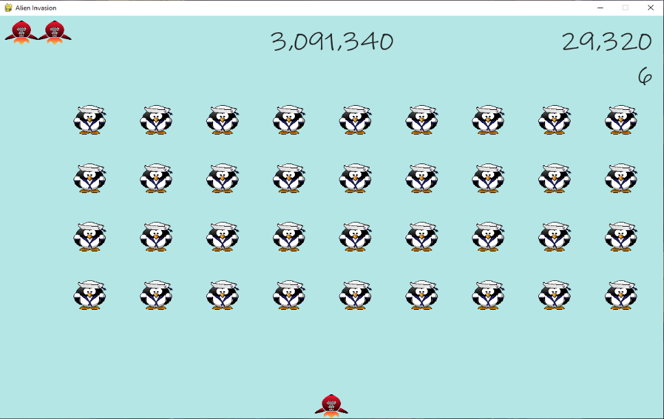

# Weekend-Projects
Continued learning by trying new projects in my free time 

Python files that are interactive. Thus far this Repository contains:
 * Alien Invaders
 * Rock Paper Scissors
 * Candy Store Shopping

## Alien Invaders
Utilizing pygame to fight decending aliens!!
* CLick start to start, SPACE to shoot and arrows to move left and right
* Levels increase in both difficulity and point value as game continues
* q, esc, or x in corner quit game

## Rock Paper Scissors
One player vs random computer

## Cand Store Purchasing
Choose up to 5 candies from a candy cart and see the results of your choosing

